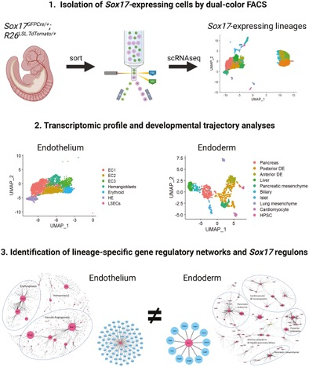

# Single-cell RNA sequencing of Sox17-expressing lineages reveals distinct gene regulatory networks and dynamic developmental trajectories

Trinh LT, Osipovich AB, Liu B, Shrestha S, Cartailler JP, Wright CVE, Magnuson MA. Stem Cells. 2023

[doi: 10.1093/stmcls/sxad030](https://pubmed.ncbi.nlm.nih.gov/37085274/) PMID: 37085274.

Processed Seurat objects are available now in [zenodo](https://zenodo.org/record/7725887#.ZA5jRR_MLkI)

